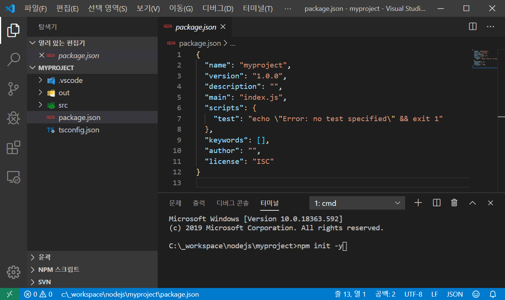
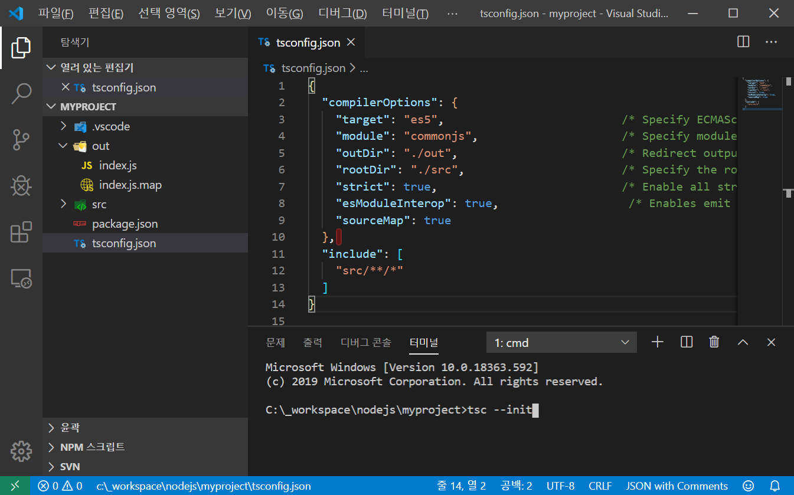
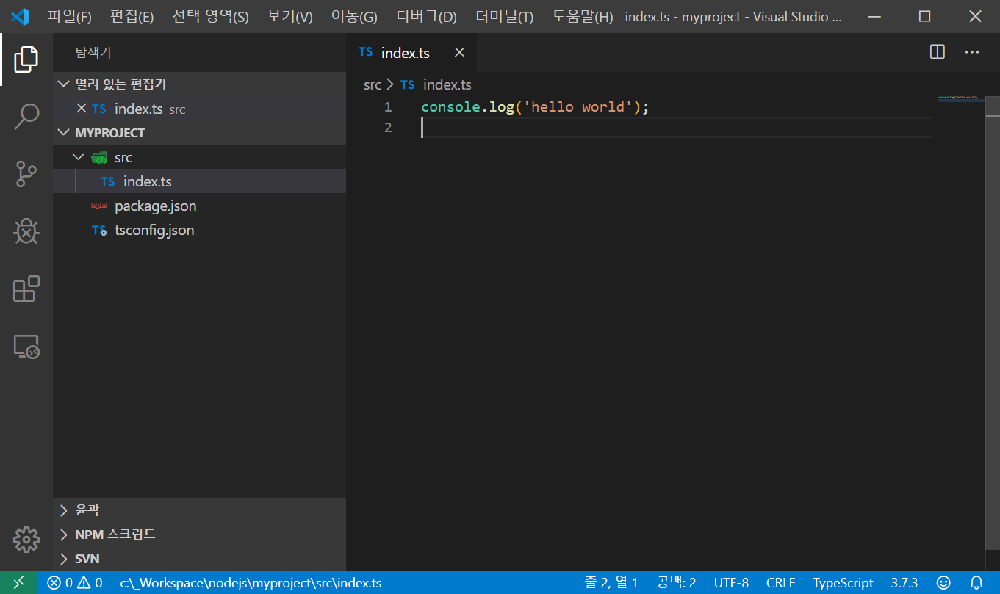
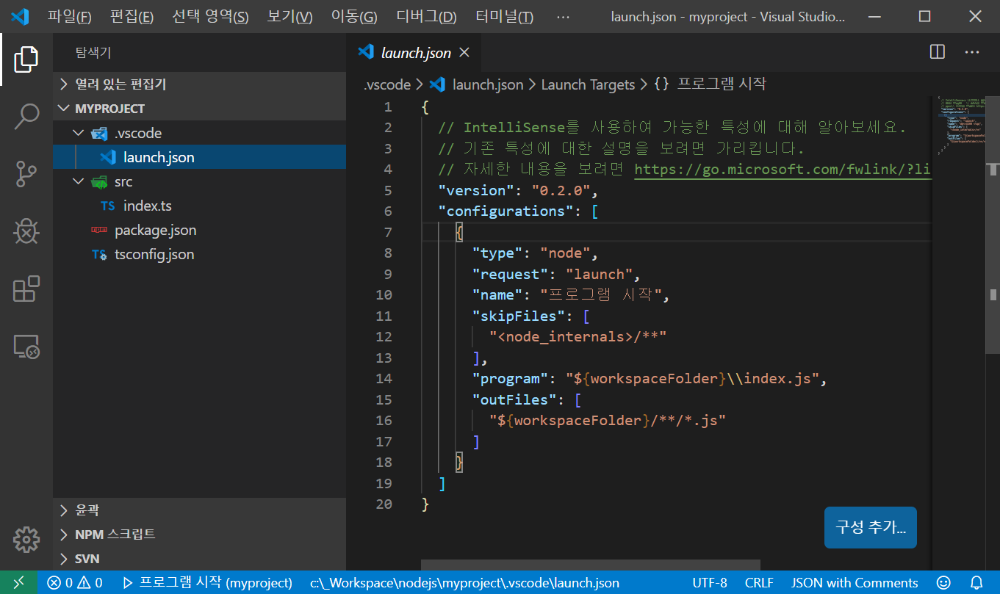
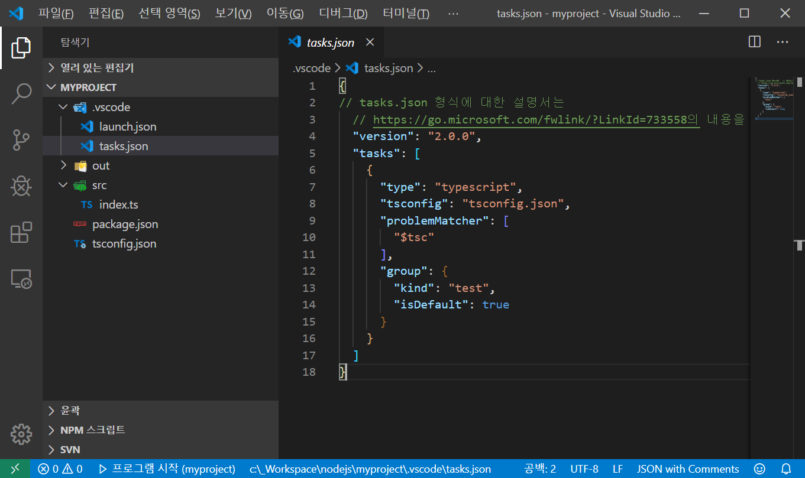

# Typescript 프로젝트 생성 관련 정리

## 1. 기본적으로 설치 되어 있어야 할것들

- nodejs - <https://nodejs.org/ko/>  
- typescript 설치 - tsc 실행을 위해...  

  ```bash
  #npm이 설치 되어 있어야 가능
  npm -i -g typescript
  ```

## 2. 프로젝트 생성

1. 프로젝트로 사용할 폴더 생성  
2. npm init 명령을 사용 하여 **package.json** 생성  
    
3. tsc --init 명령을 사용하여 **tsconfig.json** 생성  
    
4. vscode에서 디버깅 및 js 코드 생성을 위해 tsconfig에 아래와 같이 수정  

    ```json5
    {
      "compilerOptions": {
        "target": "es5",
        "module": "commonjs",
        "outDir": "./out",      /*js 생성 폴더*/
        "rootDir": "./src",     /*ts 원본 소스*/
        "strict": true,
        "esModuleInterop": true,
        "sourceMap": true       /*디버깅을 위한 Map 파일 생성*/
      },
      "include": [
        "src/**/*"              /*원본 파일 include*/
      ]
    }
    ```

5. 시작할 Typescript를 src 폴더에 생성  
    

6. vscode에서 디버깅을 위해 **launch.json**을 생성 **(디버그-> 구성 추가...)**  
    

7. launch.json을 아래와 같이 수정  

    ```json
    {
      "version": "0.2.0",
      "configurations": [
        {
          "type": "node",
          "request": "launch",
          "name": "프로그램 시작",
          "skipFiles": [
            "<node_internals>/**"
          ],
          "program": "${workspaceFolder}/src/index.ts",
          "outFiles": [
            "${workspaceFolder}/out/**/*.js"
          ],
          "preLaunchTask": "tsc: 빌드 - tsconfig.json"
        }
      ]
    }
    ```

8. 위에서 설정한 preLaunchTask를 실행 하기 위해서 **tasks.json**을 생성 해야함.  
생성은 작업창(윈도우: ctrl+p)을 열어서 **>작업: 기본 빌드 작업 구성(Tasks: Configure Default Build Task)**를 선택후
**tsc: 빌드 - tsconfig.json을 선택**
    

9. F5를 누르면 ts파일을 js로 빌드 하면서 디버깅 할 수 있음
